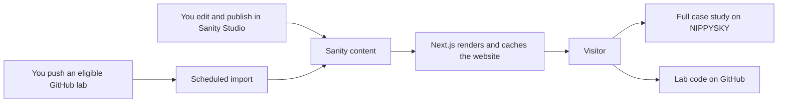

# How the portfolio works

Sanity manages the portfolio content. GitHub supplies the automatic AI & ML Lab feed. Next.js combines them into the pages visitors see.

## What each part does

- **Next.js and React:** build the pages, navigation, interactive diagram, theme switch and responsive interface. The server reads published content and serves pages with search metadata.
- **Sanity Content Lake:** stores portfolio documents and uploaded images/files in Sanity's cloud.
- **Sanity Studio (`backend/`):** the browser-based editor for those documents. This directory is not a separate custom application server.
- **GitHub:** hosts source code and coursework. A scheduled GitHub Actions job imports eligible lab metadata into Sanity.
- **NIPPYSKY:** remains the home of full company project and venture case studies. The personal site links there after describing the personal contribution.

## Editing normal portfolio content

Open Studio, edit a profile, experience, education, CV or selected-work entry, and click Publish. Once the new CMS content has been imported and `SANITY_CONTENT_READY=true`, Next.js reads it on the normal five-minute cache revalidation cycle. Revalidation is triggered by visits rather than a guaranteed clock-time push, so the first visit after expiry can still see the previous cached page. Content edits do not require deploying Studio or rebuilding the website.

For a new selected-work entry, add the title, role, contribution, image, technology tags, year and NIPPYSKY case-study URL. Set Featured to include it on the homepage. Use the Image upload field for new images. The CV in Site settings is shared by the homepage, About page and mobile navigation.

Sanity currently controls the profile headline/introduction/current focus/availability/biography, contact links/location/CV, selected-work cards, experience, education, and imported Lab presentation. Page layouts, section headings, some homepage founder/capability copy, the interactive systems diagram, SEO titles and social-image wording remain in source code. The site does not claim that every sentence is CMS editable.

## Adding a lab without entering it twice

1. Create a **public repository inside [nippysky-ai-labs](https://github.com/nippysky-ai-labs)** and push your work normally. No `portfolio-lab` topic is needed. Your unrelated personal repositories stay outside the feed.
2. The private [portfolio-sync repository](https://github.com/nippysky-ai-labs/portfolio-sync) runs an import hourly, at minute 23. GitHub schedules can be delayed.
3. The importer takes the title from the README heading, the description from the repository description or README introduction, and the language, topics and last-pushed date from GitHub.
4. It imports a cover from `.portfolio/cover`, `.github/cover`, or `cover` (PNG, JPG or WebP), then tries a suitable relative image in the README. If none exists, it creates a branded title cover automatically. It reads files as data and never executes notebooks or project code.
5. It creates and publishes the source and presentation records in Sanity. The website reads those records on its normal five-minute cache cycle.

You do not need to visit Sanity for each new lab. Studio remains available for optional title/summary/cover overrides, learning notes, homepage featuring, ordering and hiding. Future syncs preserve those edits. Descriptions reuse your repository text, and fallback covers are rendered by the importer.

A normal repository produces one card. For several coursework folders in one repository, the optional `.portfolio/labs.json` manifest can define separate cards; see the maintenance guide. A useful README or GitHub description is still needed if you want the card to explain the work accurately.

New eligible labs publish automatically. An unpublished or deleted existing presentation stays off the site. Private repositories, forks, templates, infrastructure repositories and repositories with the optional `portfolio-ignore` topic are excluded. Archived coursework stays available. Repository IDs preserve existing Sanity entries across repository renames; the organization ID is pinned to prevent importing an unrelated account after a name change.

Trustworthy AI now lives at [nippysky-ai-labs/Trustworthy-AI-Prototype-LAB](https://github.com/nippysky-ai-labs/Trustworthy-AI-Prototype-LAB).

## Why the GitHub token is not another content system

The token authenticates API requests; it does not store content or decide the portfolio's appearance. The local public feed can read public repositories without a token. GitHub Actions automatically supplies its own temporary `GITHUB_TOKEN` to the scheduled job. A personal token is not part of the local setup.

The job separately needs `SANITY_WRITE_TOKEN` to write imported metadata into Sanity. The website needs no write access to display that content. The token has been installed as an encrypted repository secret in `nippysky-ai-labs/portfolio-sync`. The local env file itself is never uploaded.

## Setup versus everyday use

On a fresh installation, before the initial import, the website uses the bundled `content/portfolio.json`; adding a token alone does not switch it to Sanity. The Lab can discover public repositories directly before mirroring is activated. After the first successful mirror, the Lab reads Sanity, so the schedule must be enabled to keep it current. Mirrors not successfully verified within 24 hours are withheld and an unavailable message is shown.

Deploy Studio after changing schema fields, Studio configuration or Studio dependencies. Publish within Studio for normal content edits. Deploy the website after changing design, code, SEO titles or social images. DNS verification of the domain is independent of all three actions.

## Free-plan controls

The organization uses GitHub Free. Its Actions budget is **$0 with Stop usage enabled**. The private importer uses standard Linux runners and the included allowance, with a two-minute limit per run and no stored build artifacts. If the included allowance is exhausted, runs stop instead of incurring paid overage. The private repository avoids GitHub’s inactivity-based disabling of schedules in public repositories. No paid subscription was added.
